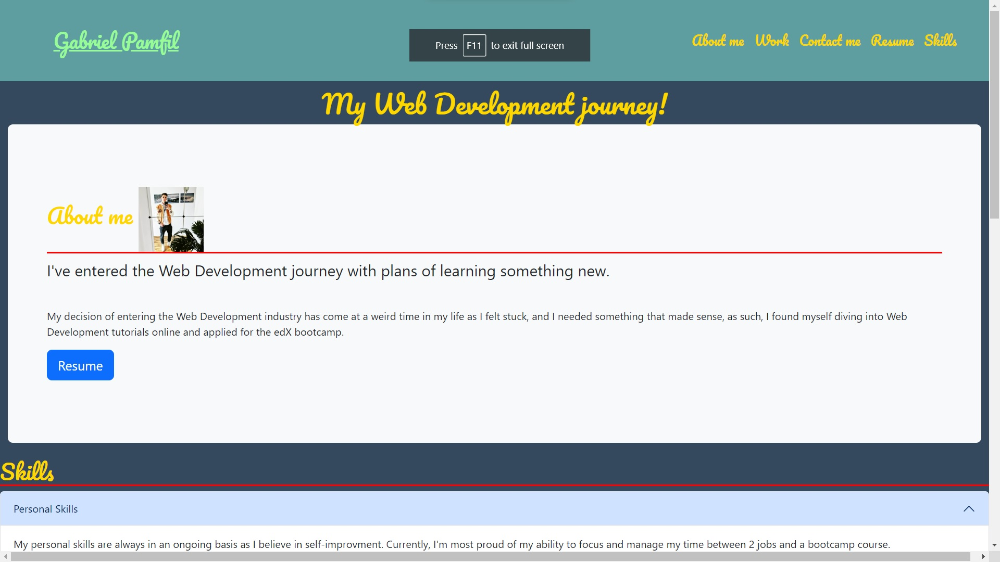

# GPbootstrap-portofolio

## Introduction

This file will show you the idea and motivation behind the project. 

I have build this project with the goal of improvment in mind, improvment from the previous portofolio project that can showcase my new developed skills.

## Utility

The website can be easily run by clicking the link: https://m4r1an24.github.io/GPbootstrap-portofolio/

Below you can see a small screenshot: 

## licence

MIT License.

## Help and guidance

Mr Kevin Stares-Darbon has helped me understand the col-12 functions and with a freedback on my hover points.

Also shout-out to LA team in AskBCS!

## 